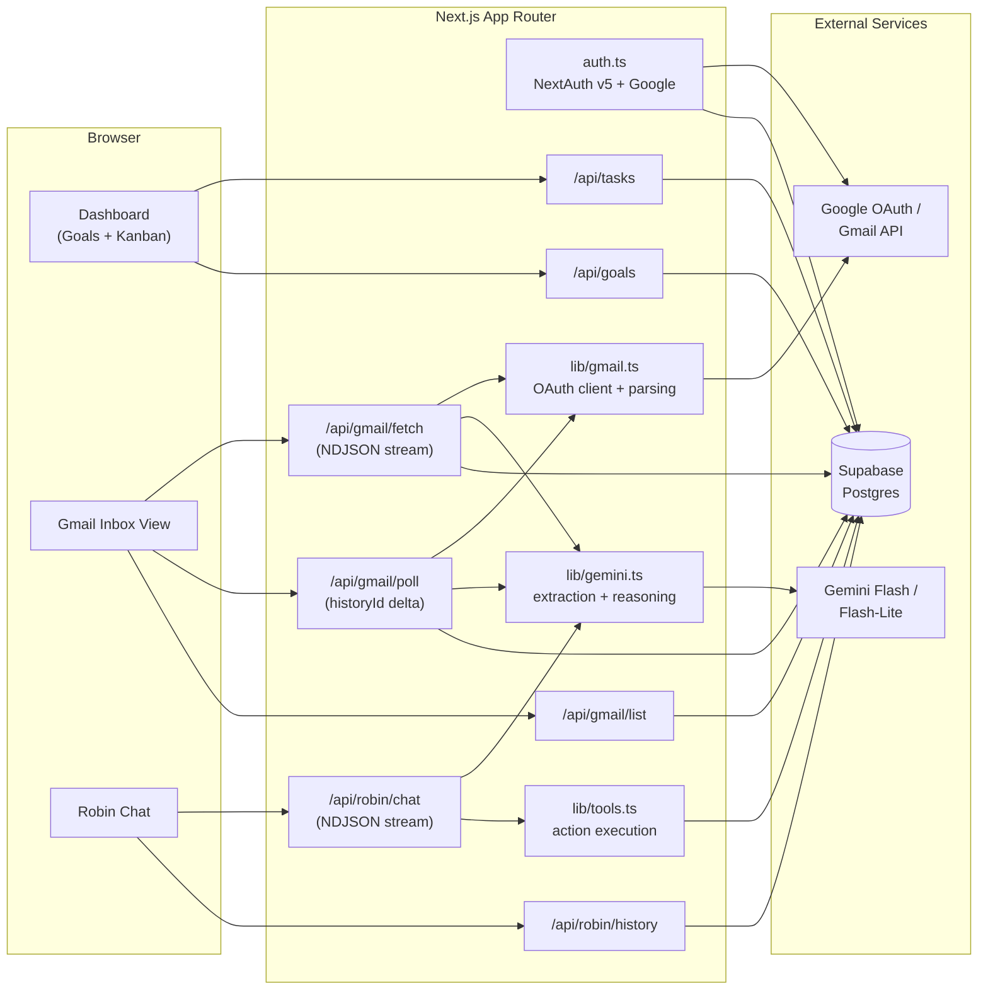
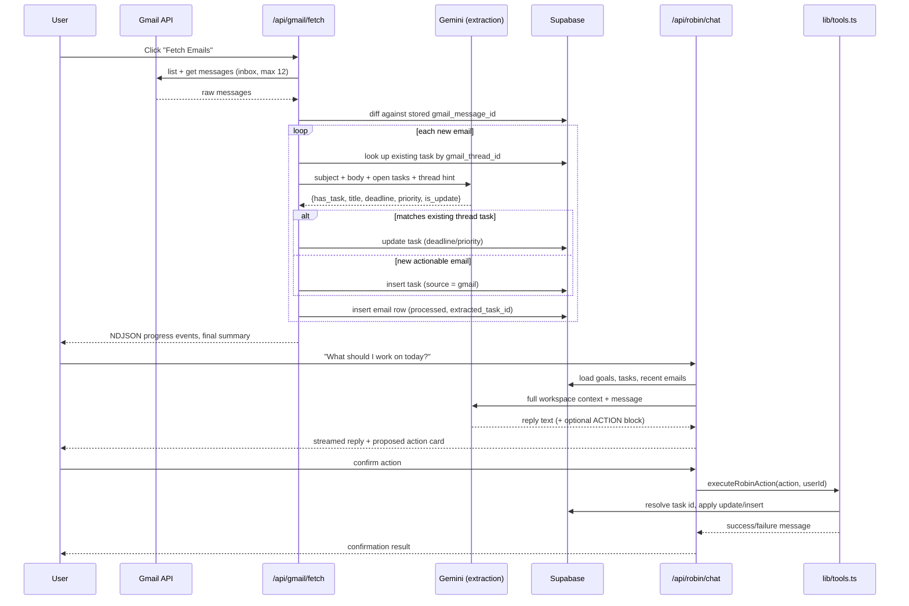
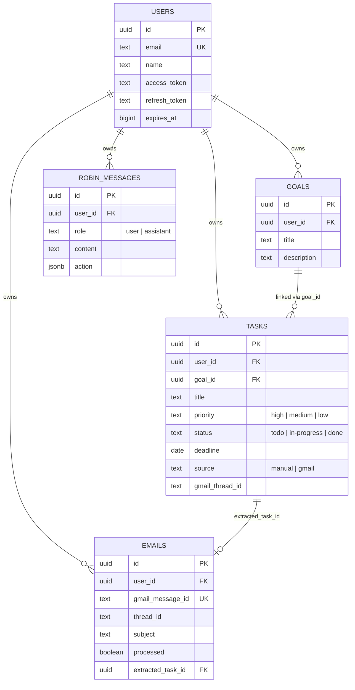

# WorkBudi

WorkBudi is a work-management assistant built on Next.js that connects a user's Gmail inbox to a structured task workspace. Incoming email is read by Gemini, converted into tasks with deadlines and priorities, and an in-app agent named Robin reasons over the resulting workspace to recommend and execute next actions — under explicit user confirmation.

The project is a working prototype: real Google OAuth, a real Gmail ingestion pipeline, a real Postgres schema on Supabase, and a real LLM-backed extraction and reasoning layer, with deterministic fallbacks wherever an external call can fail.

---

## Contents

- [System Overview](#system-overview)
- [Core Workflow](#core-workflow)
- [Data Model](#data-model)
- [Application Surface](#application-surface)
- [Robin: Reasoning and Controlled Actions](#robin-reasoning-and-controlled-actions)
- [Resilience Design](#resilience-design)
- [Tech Stack](#tech-stack)
- [Project Layout](#project-layout)
- [Setup](#setup)
- [Environment Variables](#environment-variables)
- [Running the Demo Flow](#running-the-demo-flow)
- [Known Limitations](#known-limitations)

---

## System Overview

The application has four cooperating parts: a Next.js frontend/API layer, Google OAuth + Gmail as the external data source, Supabase/Postgres as the system of record, and Gemini as the reasoning engine (email extraction and chat).



---

## Core Workflow

The end-to-end loop the product is built around:



Two entry points feed the same extraction pipeline: `/api/gmail/fetch` (manual, batch of the latest 12 inbox messages) and `/api/gmail/poll` (incremental, driven by Gmail's `historyId` so only messages added since the last checkpoint are processed). Both funnel through the same Gemini extraction call and the same thread-based deduplication logic, so a reply on an existing thread updates the linked task instead of creating a new one.

---

## Data Model

Five tables in Postgres (`supabase/schema.sql`), all scoped by `user_id`:



Notable choices reflected in the schema:

- Google OAuth tokens are stored directly on the `users` row rather than through NextAuth's own adapter tables — `auth.ts` upserts the row itself inside the JWT callback, and `lib/gmail.ts` reads/refreshes those tokens per request.
- `tasks.gmail_thread_id` is the deduplication key that lets a reply on the same Gmail thread update an existing task instead of creating a duplicate.
- `robin_messages.action` stores the proposed structured action (if any) alongside the assistant's reply, so a confirmed action can be recovered from chat history if the client doesn't resend it explicitly.

---

## Application Surface

| Route | Purpose |
|---|---|
| `/login` | Google sign-in, redirects into the app on success |
| `/dashboard` | Goal management and a three-column Kanban board (`todo` / `in-progress` / `done`) for tasks |
| `/gmail` | Inbox list backed by cached Supabase rows, manual "Fetch Emails" trigger, live polling for new mail |
| `/robin` | Multi-session chat interface with Robin, renders proposed actions as confirm/reject cards |

Each surface talks only to the app's own API routes; none of the pages call Google or Gemini directly.

| API Route | Method | Responsibility |
|---|---|---|
| `/api/auth/[...nextauth]` | — | NextAuth v5 handlers for the Google OAuth flow |
| `/api/goals` | GET / POST / DELETE | Goal CRUD |
| `/api/tasks` | GET / POST / PATCH / DELETE | Task CRUD, with server-side status/priority validation |
| `/api/gmail/fetch` | POST | Streams (NDJSON) a full fetch + extraction pass over the latest inbox messages |
| `/api/gmail/poll` | GET | Delta fetch using a client-supplied `historyId` checkpoint |
| `/api/gmail/list` | GET | Returns the last 50 cached emails for the inbox view |
| `/api/robin/chat` | POST | Streams (NDJSON) Robin's reasoning turn, and separately handles confirmed-action execution |
| `/api/robin/history` | GET / DELETE | Loads or clears a user's chat history |

---

## Robin: Reasoning and Controlled Actions

Robin's behavior is defined entirely by `lib/prompts/robin_system_prompt.md`, loaded at process start and passed as the Gemini system instruction. Two things about that design are worth calling out:

**Prioritization is rule-based, not left to the model's judgement alone.** The prompt specifies a fixed decision order — deadline urgency, then priority level, then goal alignment, then any business impact implied by linked email context — so recommendations are explainable rather than ad hoc.

**Actions are opt-in and structured.** Robin only appends a machine-readable action block when the user explicitly asks for a change, and only one per response:

```
ACTION:{"type":"update_task_status","params":{"task_id":"...","status":"in-progress"},"description":"..."}
```

The frontend renders this as a confirmation card; nothing is written to the database until the user confirms. On confirmation, `lib/tools.ts` executes the action against Supabase. That module does its own defensive resolution rather than trusting the model's output verbatim:

- `resolveTaskId` accepts an exact UUID, a UUID prefix, a title-keyword match, or — if all else fails — falls back to the user's highest-priority open task, so a slightly malformed reference from the model doesn't hard-fail the action.
- `normalizeStatus` / `normalizePriority` map a range of natural-language synonyms (`"wip"`, `"ongoing"`, `"urgent"`, `"critical"`, etc.) onto the three canonical enum values enforced by the database's `check` constraints.

Every write is additionally scoped with `.eq("user_id", userId)`, so a resolved task ID can never be used to mutate another user's row.

---

## Resilience Design

Two independent points of external failure are each given a fallback path rather than surfacing an error to the user:

1. **Model availability** — `lib/gemini.ts` tries `gemini-flash-latest` first, then `gemini-flash-lite-latest`, with a 4-second timeout race per attempt. If both fail, email extraction falls back to a keyword heuristic (urgency and actionability keywords), and Robin's chat falls back to `localRobinReasoning`, a deterministic reasoning function that inspects intent keywords and workspace state directly — no external call required.
2. **Chat persistence** — writes to `robin_messages` are wrapped so that a missing/misconfigured table degrades to a stateless chat rather than a hard error; `/api/robin/history` returns an empty list under the same condition.

---

## Tech Stack

| Layer | Technology |
|---|---|
| Framework | Next.js 16 (App Router), React 19, TypeScript |
| Auth | NextAuth v5 (beta) with the Google provider, `gmail.readonly` scope |
| Database | Supabase (Postgres) |
| AI — extraction & reasoning | Google Gemini (`gemini-flash-latest` → `gemini-flash-lite-latest`), via `@google/generative-ai` |
| Gmail access | `googleapis` (OAuth2 client, message list/get, history delta) |
| Styling | Tailwind CSS v4 + custom CSS |
| Markdown rendering | `react-markdown` (used for Robin's replies) |

---

## Project Layout

```
workbudi/
├── app/
│   ├── api/
│   │   ├── auth/[...nextauth]/route.ts   OAuth handlers
│   │   ├── goals/route.ts                Goal CRUD
│   │   ├── tasks/route.ts                Task CRUD
│   │   ├── gmail/
│   │   │   ├── fetch/route.ts            Batch fetch + extraction (streaming)
│   │   │   ├── poll/route.ts             historyId-based delta fetch
│   │   │   └── list/route.ts             Cached inbox read
│   │   └── robin/
│   │       ├── chat/route.ts             Reasoning + action execution (streaming)
│   │       └── history/route.ts          Chat log read/clear
│   ├── dashboard/page.tsx                Goals + Kanban board
│   ├── gmail/page.tsx                    Inbox view + polling
│   ├── robin/page.tsx                    Chat UI, multi-session
│   └── login/page.tsx                    Sign-in screen
├── components/
│   ├── Navbar.tsx
│   └── Providers.tsx
├── lib/
│   ├── supabase.ts                       Client + service-role admin client
│   ├── gmail.ts                          OAuth token handling, MIME parsing, history diffing
│   ├── gemini.ts                         Extraction, Robin reasoning, model fallback
│   ├── tools.ts                          Action normalization + execution
│   └── prompts/robin_system_prompt.md    Robin's full system instruction
├── types/index.ts                        Shared domain types
├── supabase/schema.sql                   Database schema
└── auth.ts                               NextAuth configuration
```

---

## Setup

### 1. Install

```bash
git clone <your-repo-url>
cd workbudi
npm install
```

### 2. Configure environment

```bash
cp .env.example .env.local
```

See [Environment Variables](#environment-variables) below for what each key needs.

### 3. Provision the database

Run `supabase/schema.sql` in the Supabase SQL editor for your project. This creates `users`, `goals`, `tasks`, `emails`, and `robin_messages`.

### 4. Run

```bash
npm run dev
```

Open `http://localhost:3000`.

---

## Environment Variables

| Variable | Used by | Notes |
|---|---|---|
| `NEXTAUTH_URL` | `auth.ts`, `lib/gmail.ts` | Must match the OAuth redirect URI registered with Google |
| `AUTH_SECRET` | NextAuth | Session signing secret |
| `GOOGLE_CLIENT_ID` / `GOOGLE_CLIENT_SECRET` | `auth.ts`, `lib/gmail.ts` | Google Cloud OAuth 2.0 client, needs the Gmail API enabled |
| `NEXT_PUBLIC_SUPABASE_URL` | `lib/supabase.ts` | Supabase project URL |
| `NEXT_PUBLIC_SUPABASE_ANON_KEY` | `lib/supabase.ts` | Client-side key |
| `SUPABASE_SERVICE_ROLE_KEY` | `lib/supabase.ts`, `auth.ts` | Server-side key used for all admin writes; keep this secret and server-only |
| `GEMINI_API_KEY` | `lib/gemini.ts` | Google AI Studio / Gemini API key |

---

## Running the Demo Flow

1. Sign in with Google at `/login`.
2. Create a goal on `/dashboard`.
3. Go to `/gmail` and click **Fetch Emails** — watch the streamed progress as WorkBudi pulls inbox messages and extracts tasks with deadlines.
4. Reply to one of the extracted threads from your actual Gmail client, then let polling run (or refetch) — confirm the existing task is updated rather than duplicated.
5. Go to `/robin` and ask *"What should I work on today?"* — Robin should recommend a task based on deadline, priority, and goal alignment.
6. Ask Robin to *"move the top task to in-progress"*, review the proposed action card, and confirm it. Verify the status change on `/dashboard`.

---

## Known Limitations

- Gmail scope is read-only (`gmail.readonly`); WorkBudi never sends mail on a user's behalf, by design (also stated explicitly in Robin's system prompt).
- `/api/gmail/fetch` looks only at the most recent 12 inbox messages per run; it is not a full-history sync.
- `robin_messages` failures are swallowed silently to keep chat usable — this trades off visibility into persistence errors for availability.
- There is no Row Level Security defined in `supabase/schema.sql`; all authorization currently happens in the API layer via `service_role` calls scoped with `eq("user_id", ...)`. If the Supabase project is used with anon-key client access anywhere, RLS policies should be added before that access is trusted.
