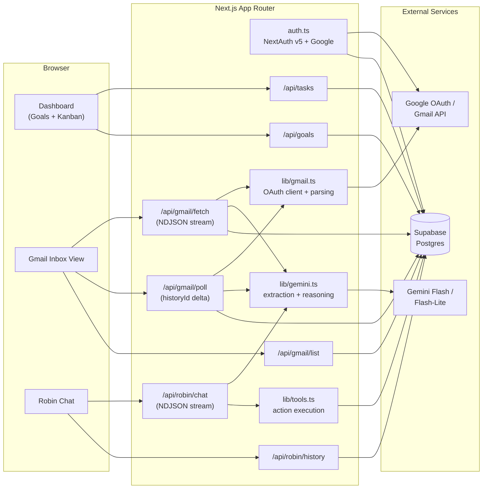
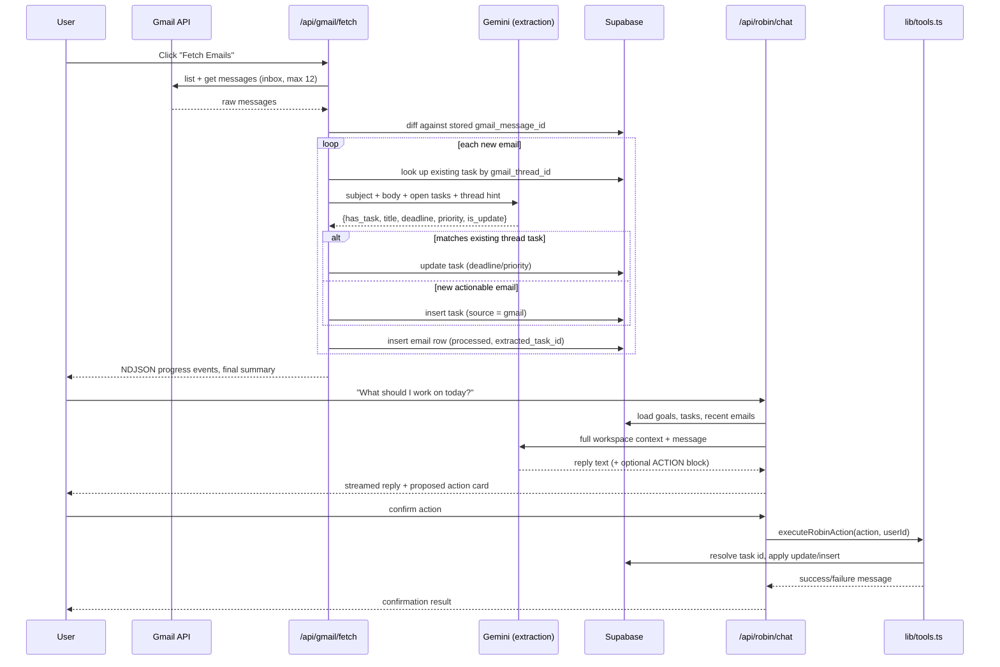
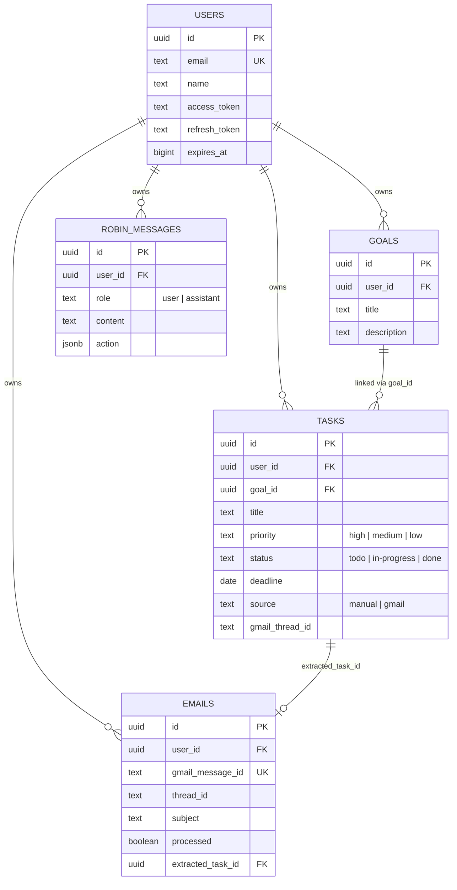

# WorkBudi

WorkBudi is a work-management assistant built on Next.js that connects a user's Gmail inbox to a structured task workspace. Incoming email is read by Gemini, converted into tasks with deadlines and priorities, and an in-app agent named Robin reasons over the resulting workspace to recommend and execute next actions — under explicit user confirmation.

The project is a working prototype: real Google OAuth, a real Gmail ingestion pipeline, a real Postgres schema on Supabase, and a real LLM-backed extraction and reasoning layer, with deterministic fallbacks wherever an external call can fail.

---

## Contents

- [System Overview](#system-overview)
- [Core Workflow](#core-workflow)
- [Data Model](#data-model)
- [Application Surface](#application-surface)
- [Robin: Reasoning and Controlled Actions](#robin-reasoning-and-controlled-actions)
- [Resilience Design](#resilience-design)
- [Tech Stack](#tech-stack)
- [Project Layout](#project-layout)
- [Setup](#setup)
- [Environment Variables](#environment-variables)
- [Running the Demo Flow](#running-the-demo-flow)
- [Known Limitations](#known-limitations)

---

## System Overview

The application has four cooperating parts: a Next.js frontend/API layer, Google OAuth + Gmail as the external data source, Supabase/Postgres as the system of record, and Gemini as the reasoning engine (email extraction and chat).



---

## Core Workflow

The end-to-end loop the product is built around:



Two entry points feed the same extraction pipeline: `/api/gmail/fetch` (manual, batch of the latest 12 inbox messages) and `/api/gmail/poll` (incremental, driven by Gmail's `historyId` so only messages added since the last checkpoint are processed). Both funnel through the same Gemini extraction call and the same thread-based deduplication logic, so a reply on an existing thread updates the linked task instead of creating a new one.

---

## Data Model

Five tables in Postgres (`supabase/schema.sql`), all scoped by `user_id`:



Notable choices reflected in the schema:

- Google OAuth tokens are stored directly on the `users` row rather than through NextAuth's own adapter tables — `auth.ts` upserts the row itself inside the JWT callback, and `lib/gmail.ts` reads/refreshes those tokens per request.
- `tasks.gmail_thread_id` is the deduplication key that lets a reply on the same Gmail thread update an existing task instead of creating a duplicate.
- `robin_messages.action` stores the proposed structured action (if any) alongside the assistant's reply, so a confirmed action can be recovered from chat history if the client doesn't resend it explicitly.

---

## Application Surface

| Route | Purpose |
|---|---|
| `/login` | Google sign-in, redirects into the app on success |
| `/dashboard` | Goal management and a three-column Kanban board (`todo` / `in-progress` / `done`) for tasks |
| `/gmail` | Inbox list backed by cached Supabase rows, manual "Fetch Emails" trigger, live polling for new mail |
| `/robin` | Multi-session chat interface with Robin, renders proposed actions as confirm/reject cards |

Each surface talks only to the app's own API routes; none of the pages call Google or Gemini directly.

| API Route | Method | Responsibility |
|---|---|---|
| `/api/auth/[...nextauth]` | — | NextAuth v5 handlers for the Google OAuth flow |
| `/api/goals` | GET / POST / DELETE | Goal CRUD |
| `/api/tasks` | GET / POST / PATCH / DELETE | Task CRUD, with server-side status/priority validation |
| `/api/gmail/fetch` | POST | Streams (NDJSON) a full fetch + extraction pass over the latest inbox messages |
| `/api/gmail/poll` | GET | Delta fetch using a client-supplied `historyId` checkpoint |
| `/api/gmail/list` | GET | Returns the last 50 cached emails for the inbox view |
| `/api/robin/chat` | POST | Streams (NDJSON) Robin's reasoning turn, and separately handles confirmed-action execution |
| `/api/robin/history` | GET / DELETE | Loads or clears a user's chat history |

---

## Robin: Reasoning and Controlled Actions

Robin's behavior is defined entirely by `lib/prompts/robin_system_prompt.md`, loaded at process start and passed as the Gemini system instruction. Two things about that design are worth calling out:

**Prioritization is rule-based, not left to the model's judgement alone.** The prompt specifies a fixed decision order — deadline urgency, then priority level, then goal alignment, then any business impact implied by linked email context — so recommendations are explainable rather than ad hoc.

**Actions are opt-in and structured.** Robin only appends a machine-readable action block when the user explicitly asks for a change, and only one per response:

```
ACTION:{"type":"update_task_status","params":{"task_id":"...","status":"in-progress"},"description":"..."}
```

The frontend renders this as a confirmation card; nothing is written to the database until the user confirms. On confirmation, `lib/tools.ts` executes the action against Supabase. That module does its own defensive resolution rather than trusting the model's output verbatim:

- `resolveTaskId` accepts an exact UUID, a UUID prefix, a title-keyword match, or — if all else fails — falls back to the user's highest-priority open task, so a slightly malformed reference from the model doesn't hard-fail the action.
- `normalizeStatus` / `normalizePriority` map a range of natural-language synonyms (`"wip"`, `"ongoing"`, `"urgent"`, `"critical"`, etc.) onto the three canonical enum values enforced by the database's `check` constraints.

Every write is additionally scoped with `.eq("user_id", userId)`, so a resolved task ID can never be used to mutate another user's row.

---

## Resilience Design

Two independent points of external failure are each given a fallback path rather than surfacing an error to the user:

1. **Model availability** — `lib/gemini.ts` tries `gemini-flash-latest` first, then `gemini-flash-lite-latest`, with a 4-second timeout race per attempt. If both fail, email extraction falls back to a keyword heuristic (urgency and actionability keywords), and Robin's chat falls back to `localRobinReasoning`, a deterministic reasoning function that inspects intent keywords and workspace state directly — no external call required.
2. **Chat persistence** — writes to `robin_messages` are wrapped so that a missing/misconfigured table degrades to a stateless chat rather than a hard error; `/api/robin/history` returns an empty list under the same condition.

---

## Tech Stack

| Layer | Technology |
|---|---|
| Framework | Next.js 16 (App Router), React 19, TypeScript |
| Auth | NextAuth v5 (beta) with the Google provider, `gmail.readonly` scope |
| Database | Supabase (Postgres) |
| AI — extraction & reasoning | Google Gemini (`gemini-flash-latest` → `gemini-flash-lite-latest`), via `@google/generative-ai` |
| Gmail access | `googleapis` (OAuth2 client, message list/get, history delta) |
| Styling | Tailwind CSS v4 + custom CSS |
| Markdown rendering | `react-markdown` (used for Robin's replies) |

---

## Project Layout

```
workbudi/
├── app/
│   ├── api/
│   │   ├── auth/[...nextauth]/route.ts   OAuth handlers
│   │   ├── goals/route.ts                Goal CRUD
│   │   ├── tasks/route.ts                Task CRUD
│   │   ├── gmail/
│   │   │   ├── fetch/route.ts            Batch fetch + extraction (streaming)
│   │   │   ├── poll/route.ts             historyId-based delta fetch
│   │   │   └── list/route.ts             Cached inbox read
│   │   └── robin/
│   │       ├── chat/route.ts             Reasoning + action execution (streaming)
│   │       └── history/route.ts          Chat log read/clear
│   ├── dashboard/page.tsx                Goals + Kanban board
│   ├── gmail/page.tsx                    Inbox view + polling
│   ├── robin/page.tsx                    Chat UI, multi-session
│   └── login/page.tsx                    Sign-in screen
├── components/
│   ├── Navbar.tsx
│   └── Providers.tsx
├── lib/
│   ├── supabase.ts                       Client + service-role admin client
│   ├── gmail.ts                          OAuth token handling, MIME parsing, history diffing
│   ├── gemini.ts                         Extraction, Robin reasoning, model fallback
│   ├── tools.ts                          Action normalization + execution
│   └── prompts/robin_system_prompt.md    Robin's full system instruction
├── types/index.ts                        Shared domain types
├── supabase/schema.sql                   Database schema
└── auth.ts                               NextAuth configuration
```

---

## Setup

### 1. Install

```bash
git clone <your-repo-url>
cd workbudi
npm install
```

### 2. Configure environment

```bash
cp .env.example .env.local
```

See [Environment Variables](#environment-variables) below for what each key needs.

### 3. Provision the database

Run `supabase/schema.sql` in the Supabase SQL editor for your project. This creates `users`, `goals`, `tasks`, `emails`, and `robin_messages`.

### 4. Run

```bash
npm run dev
```

Open `http://localhost:3000`.

---

## Environment Variables

| Variable | Used by | Notes |
|---|---|---|
| `NEXTAUTH_URL` | `auth.ts`, `lib/gmail.ts` | Must match the OAuth redirect URI registered with Google |
| `AUTH_SECRET` | NextAuth | Session signing secret |
| `GOOGLE_CLIENT_ID` / `GOOGLE_CLIENT_SECRET` | `auth.ts`, `lib/gmail.ts` | Google Cloud OAuth 2.0 client, needs the Gmail API enabled |
| `NEXT_PUBLIC_SUPABASE_URL` | `lib/supabase.ts` | Supabase project URL |
| `NEXT_PUBLIC_SUPABASE_ANON_KEY` | `lib/supabase.ts` | Client-side key |
| `SUPABASE_SERVICE_ROLE_KEY` | `lib/supabase.ts`, `auth.ts` | Server-side key used for all admin writes; keep this secret and server-only |
| `GEMINI_API_KEY` | `lib/gemini.ts` | Google AI Studio / Gemini API key |

---

## Running the Demo Flow

1. Sign in with Google at `/login`.
2. Create a goal on `/dashboard`.
3. Go to `/gmail` and click **Fetch Emails** — watch the streamed progress as WorkBudi pulls inbox messages and extracts tasks with deadlines.
4. Reply to one of the extracted threads from your actual Gmail client, then let polling run (or refetch) — confirm the existing task is updated rather than duplicated.
5. Go to `/robin` and ask *"What should I work on today?"* — Robin should recommend a task based on deadline, priority, and goal alignment.
6. Ask Robin to *"move the top task to in-progress"*, review the proposed action card, and confirm it. Verify the status change on `/dashboard`.

---

## Robin: AI Approach

### How Robin Reasons

Robin is not a general-purpose chatbot. It has a fixed identity and a structured reasoning model that is loaded from `lib/prompts/robin_system_prompt.md` at process start and passed as the Gemini system instruction. This separation matters: the system prompt defines what Robin *is*, while the user-turn prompt injects what the user *has* — two completely independent concerns.

Every Robin turn is structured as four layered context blocks injected into the user-turn prompt:

```
=== USER GOALS ===
[goal list from Supabase]

=== TASKS IN DATABASE ===
[task list with UUIDs, priorities, statuses, deadlines]

=== RECENT INBOUND EMAILS ===
[latest emails with snippets that provide business context]

=== CONVERSATION HISTORY ===
[last 4 turns so Robin can refer back to prior context]

=== USER MESSAGE ===
[the user's actual message]
```

The system prompt then constrains how Robin uses this context via a fixed four-tier decision order: **(1) Deadline urgency → (2) Priority level → (3) Goal alignment → (4) Email-derived business impact**. This means Robin's recommendations are always explainable — there is no magic, the user can understand exactly why Robin surfaced a given task.

### Why Controlled Actions (Not Direct DB Access)

Robin never writes to the database directly. When the user asks Robin to take a workspace action, Robin appends a single structured `ACTION:{...}` block at the end of its response. The frontend renders this as a confirmation card. Only after the user explicitly confirms does `lib/tools.ts` execute the action against Supabase — under its own defensive layer:

- **`resolveTaskId`**: accepts exact UUID, UUID prefix, or title keyword match so a slightly malformed LLM reference does not hard-fail the operation.
- **`normalizeStatus` / `normalizePriority`**: maps natural language synonyms (`"wip"`, `"ongoing"`, `"urgent"`) onto the canonical database enum values.
- **User scope guard**: every write carries `.eq("user_id", userId)` so a resolved task ID from one user can never mutate another user's row.

This is the correct architecture for any production AI assistant operating on real user data: the LLM proposes, the user confirms, the tool layer executes defensively.

### Fallback Architecture

`lib/gemini.ts` implements a three-layer fallback:

1. **`gemini-flash-latest`** (primary, 4-second timeout race)
2. **`gemini-flash-lite-latest`** (secondary, same timeout)
3. **`localRobinReasoning`** (deterministic, no external call) — inspects intent keywords and workspace state directly to produce a reasonable recommendation without Gemini

This means Robin remains usable even if the Gemini API is fully down, rate-limited, or the user is on a free-tier key during a demo.

---

## Extending to Calendar and Slack

The current WorkBudi loop handles one inbound communication channel — Gmail. The architecture was deliberately designed as a **source-agnostic ingestion pipeline** so that adding Calendar and Slack requires new adapters, not a rethinking of the core engine.

The pipeline that already exists for Gmail:

```
Inbound Source → OAuth + Token Refresh → Raw Message Fetch
→ LLM Extraction (subject + body + existing tasks + thread hint)
→ Thread-Aware Deduplication (thread_id key on tasks table)
→ Supabase Insert/Update
→ Robin Context Injection (Goals + Tasks + Emails + new sources)
→ Controlled Action Execution (lib/tools.ts allowlist)
```

Every step of this pipeline is format-agnostic. The Gemini extraction prompt takes `subject` and `body` — it does not care whether those came from an email, a calendar invite description, or a Slack message. The deduplication key (`gmail_thread_id`) is already a generic pattern — it just needs a column name change to become `thread_id` with a `source` discriminator.

### Google Calendar

**What needs to be added:**

1. **OAuth scope** — expand `auth.ts` to request `https://www.googleapis.com/auth/calendar.readonly`. No new OAuth flow needed; it is the same Google token the user already granted. For write actions, request `calendar.events`.

2. **New adapter `lib/calendar.ts`** — mirroring `lib/gmail.ts`:
   ```ts
   // Fetch the next 7 days of events + free/busy blocks
   export async function getUpcomingEvents(accessToken: string) {
     const calendar = google.calendar({ version: "v3", auth: oauth2Client });
     const { data } = await calendar.events.list({
       calendarId: "primary",
       timeMin: new Date().toISOString(),
       timeMax: addDays(new Date(), 7).toISOString(),
       singleEvents: true,
       orderBy: "startTime",
     });
     return data.items ?? [];
   }
   ```

3. **New schema table `calendar_events`** — to cache fetched events and avoid re-fetching on every Robin turn:
   ```sql
   create table public.calendar_events (
     id uuid primary key default gen_random_uuid(),
     user_id uuid not null references public.users(id) on delete cascade,
     google_event_id text not null,
     title text not null,
     start_time timestamptz not null,
     end_time timestamptz not null,
     is_focus_block boolean default false,
     unique (user_id, google_event_id)
   );
   ```

4. **Robin context injection** — add a fifth context block to the user-turn prompt in `lib/gemini.ts`:
   ```
   === UPCOMING CALENDAR (next 7 days) ===
   - Today 2pm–4pm: Client sync (busy)
   - Tomorrow 10am–11am: Team standup (busy)
   - Tomorrow 11am–3pm: FREE (4-hour focus block available)
   ```
   Robin can now say: *"Your highest-priority task — Revised Proposal (due Friday) — has a 4-hour window tomorrow from 11am. I recommend protecting that as a focus block."*

5. **New controlled action** — extend `lib/tools.ts` and the system prompt with:
   ```
   ACTION:{"type":"create_calendar_focus_block","params":{"title":"Deep Work: Revised Proposal","start":"2026-08-27T11:00:00+05:30","duration_minutes":120}}
   ```

**Key design point:** Robin does not autonomously schedule meetings. It proposes a specific focus block and shows a confirmation card. The user confirms before the Calendar API write happens — the same human-in-the-loop pattern as task mutations today.

---

### Slack

**What needs to be added:**

1. **Slack OAuth** — install a Slack App in the user's workspace with `channels:history`, `im:history`, `app_mentions:read`, and `chat:write` bot scopes. Store the `slack_bot_token` and `slack_user_id` on the `users` row alongside the Google tokens.

2. **Inbound webhook handler `app/api/slack/events/route.ts`** — handle Slack's Events API payload verification (HMAC-SHA256 signature) and route `message` and `app_mention` events:
   ```ts
   export async function POST(req: NextRequest) {
     // verify Slack signature
     const { event } = await req.json();
     if (event.type === "app_mention" || event.type === "message") {
       await processSlackMessage(event, userId);
     }
   }
   ```

3. **Same extraction pipeline** — `processSlackMessage` calls `extractTaskFromEmail(event.text, event.text, existingTasks, threadTask)` directly. The Gemini prompt does not need to change because it is already format-agnostic — it reads `subject` and `body` which for Slack become the message text and the thread context.

4. **Thread deduplication** — add `slack_thread_ts` and `slack_channel_id` columns to the `tasks` table (alongside the existing `gmail_thread_id`). A follow-up message in the same Slack thread updates the existing task rather than creating a duplicate, using the same deduplication logic already written in `app/api/gmail/fetch/route.ts`.

5. **Robin context injection** — add a sixth context block to the prompt in `lib/gemini.ts`:
   ```
   === RECENT SLACK CONTEXT ===
   - #engineering (2h ago): "The checkout bug is blocking the release. @suraj can you look at it?" — marked High priority
   - DM from Priya (1h ago): "Updated designs are ready for your review"
   ```

6. **Outbound Slack notifications** — when Robin executes a confirmed action (e.g. *"Moving Checkout Bug to in-progress"*), optionally post a confirmation message back to the original Slack thread using `chat.postMessage` so the team stays informed. This is the only outbound write and it requires explicit user confirmation through the same action card flow.

**Key design point:** Slack becomes another read-and-extract source, not a separate system. Robin sees Gmail threads and Slack messages in a single unified workspace context. A task that originated from a Slack mention and was then referenced in a follow-up email is one task — deduplicated by thread identifier — not two.

---

## Known Limitations

- Gmail scope is read-only (`gmail.readonly`); WorkBudi never sends mail on a user's behalf, by design (also stated explicitly in Robin's system prompt).
- `/api/gmail/fetch` looks only at the most recent 12 inbox messages per run; it is not a full-history sync.
- `robin_messages` failures are swallowed silently to keep chat usable — this trades off visibility into persistence errors for availability.
- There is no Row Level Security defined in `supabase/schema.sql`; all authorization currently happens in the API layer via `service_role` calls scoped with `eq("user_id", ...)`. If the Supabase project is used with anon-key client access anywhere, RLS policies should be added before that access is trusted.
